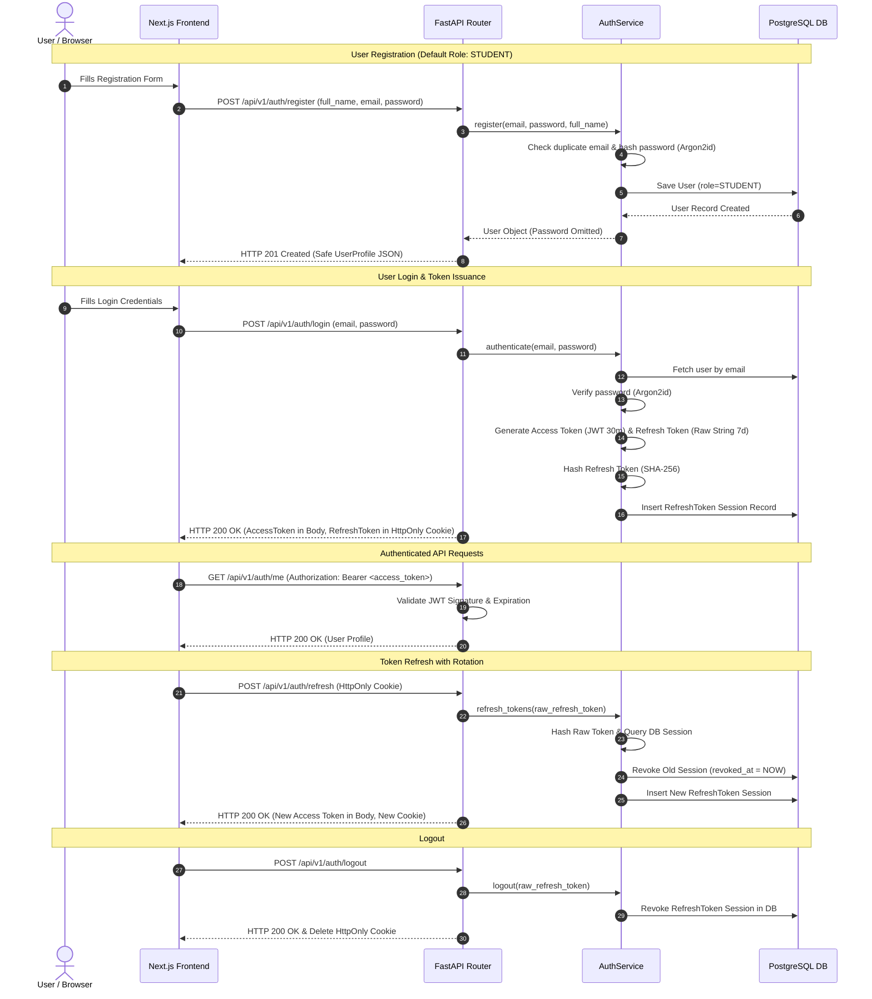

# CampusOS — Authentication & Role-Based Access Control (RBAC) Architecture

## Overview

CampusOS implements a secure, stateless-access, persistent-refresh token model with Role-Based Access Control (RBAC). Access tokens are short-lived JWTs, while refresh tokens are cryptographically generated random tokens hashed (SHA-256) and stored in PostgreSQL to enable server-side session revocation and token rotation.

---

## Role Definitions & RBAC Architecture

### 1. User Roles

Defined using a strict Python/SQLAlchemy Enum (`UserRole`):

| Role | Value | Description |
| :--- | :--- | :--- |
| **STUDENT** | `STUDENT` | Default safe role assigned on public registration. Access to student resources. |
| **FACULTY** | `FACULTY` | Professors & course instructors. Access to course management & grading. |
| **CLUB_ADMIN** | `CLUB_ADMIN` | Campus club administrators. Access to club & event management. |
| **ADMIN** | `ADMIN` | System Administrators. Full administrative privileges. |

### 2. Authorization Design

Backend authorization is enforced at the route dependency level using `require_role(...)` and `require_authenticated_user`. Authorization logic is never duplicated inside endpoints.

```python
# Route Protection Examples:
@router.get("/admin-only", dependencies=[Depends(require_role(UserRole.ADMIN))])
@router.get("/faculty-only", dependencies=[Depends(require_role(UserRole.FACULTY, UserRole.ADMIN))])
```

---

## Authentication Flow



---

## Token Strategy & Lifecycle

### 1. Access Token (JWT)
- **Format**: Signed JSON Web Token (HS256)
- **Lifespan**: 30 minutes (configurable via `ACCESS_TOKEN_EXPIRE_MINUTES`)
- **Storage**: In-memory / sessionStorage on client (never stored long-term)
- **Payload Claims**:
  ```json
  {
    "sub": "user-uuid",
    "role": "STUDENT",
    "iat": 1726180000,
    "exp": 1726181800,
    "type": "access"
  }
  ```

### 2. Refresh Token (Persistent Sessions)
- **Format**: Cryptographically random 64-character string
- **Storage**: Sent as `HttpOnly`, `SameSite=Lax`, `Secure` (production) cookie
- **Database Storage**: Only the **SHA-256 hash** of the raw token is saved in PostgreSQL
- **Rotation**: On every `/refresh` request, the presented refresh token is immediately revoked and a new pair is issued.
- **Revocation**: Logout immediately marks the session's `revoked_at` timestamp in PostgreSQL.

---

## Security Decisions Summary

1. **Argon2id Hashing**: Standardized on Argon2id via `argon2-cffi` to guard against GPU/ASIC brute-force attacks.
2. **Public Privilege Boundary**: Public self-registration endpoint (`/register`) **always hardcodes `STUDENT`**. Role self-assignment to `ADMIN` or `FACULTY` is impossible.
3. **No Credential Leakage**: `password` and `password_hash` fields are excluded from all Pydantic response schemas (`UserResponse`).
4. **Token Hash Storage**: Raw refresh tokens are never persisted in the database, preventing session hijacking in case of database leaks.
5. **Mitigation Against Enumeration**: Login returns generic `Invalid email or password.` for both non-existent users and wrong passwords.

---

## Future Extensibility: OAuth2 & Single Sign-On (SSO)

The architecture is designed to accommodate external OAuth2 providers (e.g. Google Workspace for Education, Microsoft Entra ID / Azure AD, SAML 2.0) in future phases by:
- Adding `oauth_provider` and `oauth_id` columns to the `users` table.
- Reusing `create_tokens_for_user()` to issue standard CampusOS session tokens upon OAuth callback verification.
