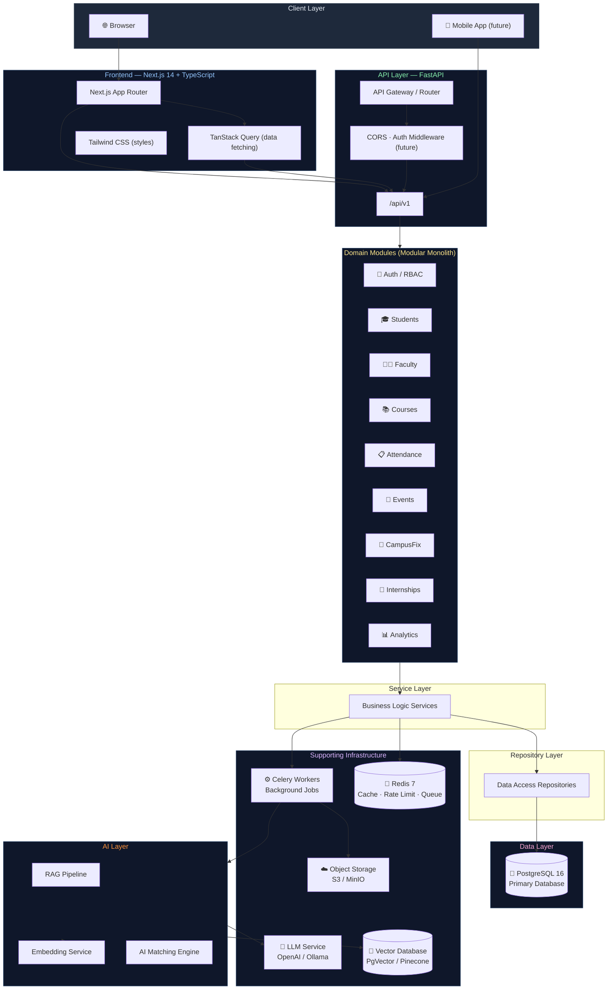

# CampusOS — System Architecture Overview

> **Version:** 0.1.0 — Foundation  
> **Last Updated:** 2026-09  
> **Architecture Pattern:** Modular Monolith

---

## 1. Introduction

CampusOS is a **production-grade university management platform** designed to unify
academics, campus services, career tools, and AI-powered features into a single,
coherent system accessible to students, faculty, administrators, and staff.

---

## 2. Why Modular Monolith?

CampusOS starts as a **modular monolith** rather than microservices because:

| Consideration | Reason |
|---|---|
| **Team size** | Small team in early phase; microservices require ops overhead that reduces velocity |
| **Operational simplicity** | Single deployment, single database, single monitoring surface |
| **Domain clarity** | Domains boundaries are established before extraction is appropriate |
| **Refactoring cost** | Splitting too early introduces distributed systems complexity (network, transactions, versioning) without benefit |
| **Extraction path** | High-load modules (AI, notifications) can be extracted when traffic justifies it |

See [ADR-001](../decisions/ADR-001-modular-monolith.md) for the full architectural decision record.

---

## 3. System Architecture Diagram



---

## 4. Request Lifecycle

```
Browser / Mobile Client
        │
        │  HTTPS
        ▼
  Next.js (SSR/CSR)
        │
        │  REST / JSON
        ▼
  FastAPI Router  ──► CORS Middleware
        │               Auth Middleware (future)
        │               Rate Limiting (future)
        ▼
  Domain Router (e.g. /api/v1/students)
        │
        ▼
  Endpoint Handler
        │
        ▼
  Service Layer  ◄─── Redis (cache lookup)
        │
        ▼
  Repository Layer
        │
        ▼
  SQLAlchemy Async Session
        │
        ▼
  PostgreSQL
```

---

## 5. Domain Modules (Planned)

Each module lives in a clearly bounded subdirectory and contains its own:
- API endpoints (`app/api/v1/endpoints/<module>.py`)
- Service layer (`app/services/<module>_service.py`)
- Repository layer (`app/repositories/<module>_repository.py`)
- ORM models (`app/models/<module>.py`)
- Pydantic schemas (`app/schemas/<module>.py`)

| Module | Status | Description |
|--------|--------|-------------|
| Health | ✅ Implemented | API liveness + readiness checks |
| Auth / RBAC | 🔜 Planned | JWT authentication, role-based access |
| Students | 🔜 Planned | Student profiles, enrollments |
| Faculty | 🔜 Planned | Faculty profiles, course assignments |
| Departments | 🔜 Planned | Organizational structure |
| Courses | 🔜 Planned | Course catalogue, timetable |
| Attendance | 🔜 Planned | Attendance tracking |
| Assignments & Exams | 🔜 Planned | Academic submissions, grading |
| Events & Clubs | 🔜 Planned | Campus events management |
| CampusFix | 🔜 Planned | Complaint & maintenance tickets |
| Notifications | 🔜 Planned | Push, email, in-app notifications |
| Internships | 🔜 Planned | Listings, applications, AI matching |
| AI Assistant | 🔜 Planned | Campus-aware LLM assistant |
| RAG Knowledge Base | 🔜 Planned | Document ingestion and retrieval |
| Admin Analytics | 🔜 Planned | Dashboards, reports |

---

## 6. Database (PostgreSQL)

PostgreSQL 16 is the **single source of truth** for all structured data.

- **Async access**: SQLAlchemy 2 with `asyncpg` driver
- **Migrations**: Alembic with autogenerate support
- **Connection pooling**: SQLAlchemy connection pool (size 10, overflow 20)
- **Future**: Read replicas for analytics queries; eventual extraction of hot tables

---

## 7. Caching (Redis)

Redis 7 serves multiple roles:

| Role | Usage |
|------|-------|
| **Response Cache** | Cache expensive DB queries (TTL-based) |
| **Rate Limiting** | Sliding window per IP/user |
| **Session Store** | JWT refresh token storage |
| **Celery Broker** | Task queue for background jobs |
| **Celery Backend** | Task result storage |
| **Pub/Sub** | Real-time notifications (future) |

---

## 8. Background Workers (Celery)

Celery processes long-running or asynchronous tasks:

- Email and push notification dispatch
- Report generation (PDF, CSV)
- AI embedding jobs (document ingestion)
- AI matching (internship recommendations)
- Scheduled tasks (cron-style reminders)

Workers run as separate processes sharing the same codebase.

---

## 9. AI / RAG Layer

The `ai/` directory contains standalone AI processing components:

- **Embeddings**: Convert documents → vector embeddings
- **RAG Pipeline**: Retrieve relevant chunks → augment LLM prompts
- **Agents**: Orchestrate multi-step AI reasoning
- **LLM Integration**: OpenAI / local Ollama for generation

AI components are called by Celery workers for heavy processing and by the
FastAPI layer for real-time inference (with strict latency budgets).

---

## 10. Object Storage

Files (lecture slides, assignment submissions, profile photos) are stored in
S3-compatible object storage (AWS S3 or local MinIO for development).

The database stores only metadata (file name, bucket key, MIME type, size).

---

## 11. Horizontal Scaling Path

```
Phase 1 (Now):     Modular Monolith — single process, single DB
Phase 2 (Later):   Add Redis caching, Celery workers, read replicas
Phase 3 (Scale):   Extract AI service → standalone container
Phase 4 (Scale):   Extract Notifications → standalone container  
Phase 5 (Scale):   Full microservices if team/traffic justifies
```

The modular structure (clean domain boundaries, repository pattern, no
circular imports between domains) ensures extraction is possible without
architectural rewrites.
